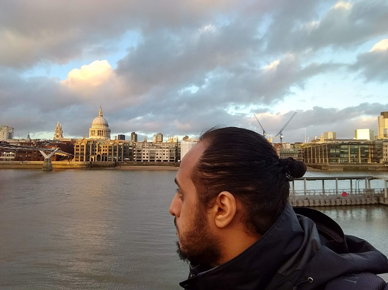
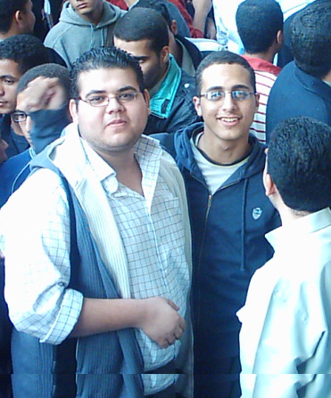

+++
title = "من أنا"
assets = ["mosab-child.png"]
+++

اسمي مصعب، وأعمل مهندسا للبرمجيات والنظم. ذاتيّ التَّعلُّم، شغوف بهندسة قواعد البيانات ، الأنظمة الموزعة، برمجة النظم، نظام التشغيل لينوكس، والبرمجيات الحرة/مفتوحة المصدر.

أحب قضاء وقع فراغي مع أسرتي أو في ممارسة إحدى هواياتي التي تتضمن: القراءة، ركوب الدراجات الهوائية، المشاريع اليدوية، الطبخ، والنجارة.



 أول حاسوب شخصي أمتلكه، منذ أكثر من عقدين من الزمان!



إليكم بعض صوري، إلى حين انتهائي من ترجمة الموقع بالكامل للعربية



آكل شطيرة وأشرب مشروبا غازيا في الوقت نفسه





أول صورة تجمعني مع صديق عمري وطفولتي، البراء أشرف. الصورة من مظاهرة أمام أحد الوزارات





البراء وأنا في مقهانا المفضل آنذاك.





هذا أول ساندويتش برجر أشتريه بأول مرتب أحصل عليه من البرمجة


