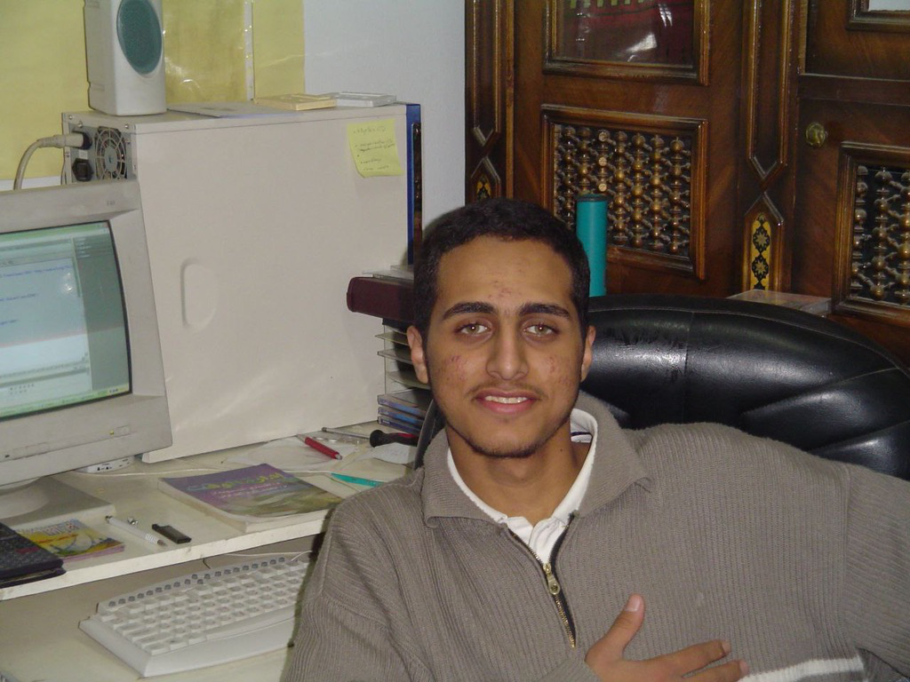
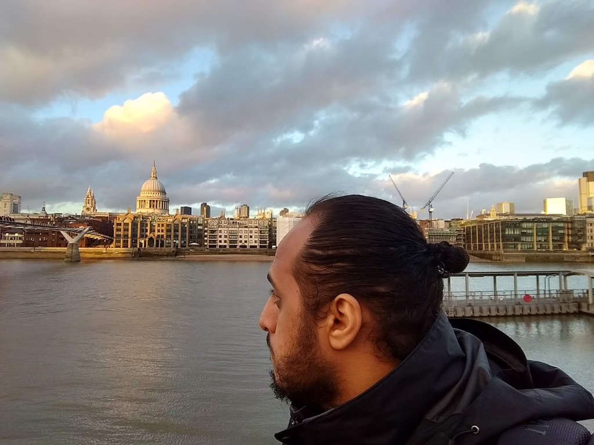
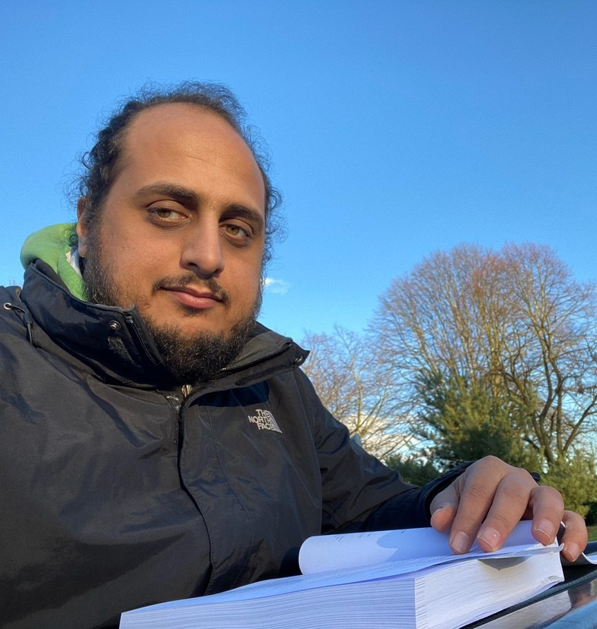
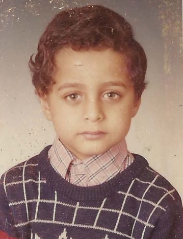
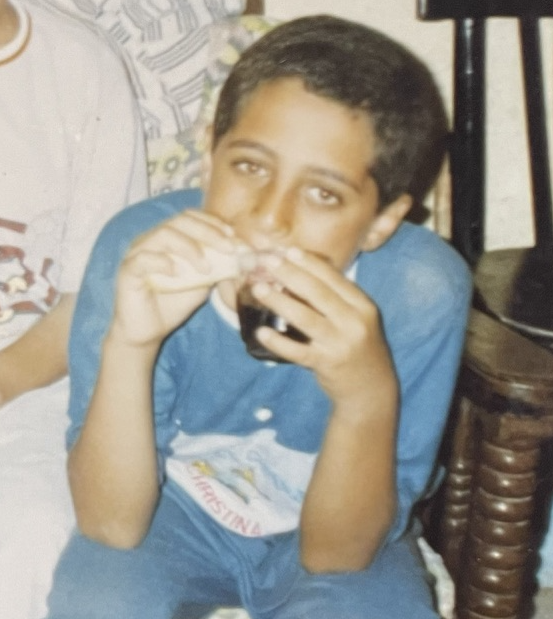
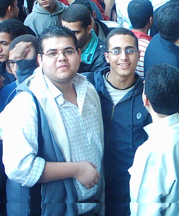
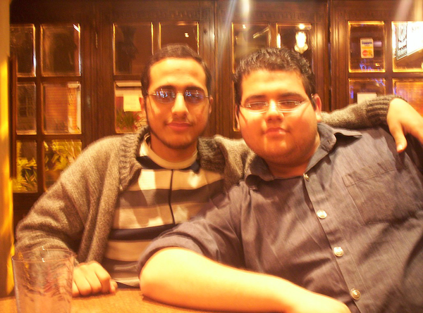
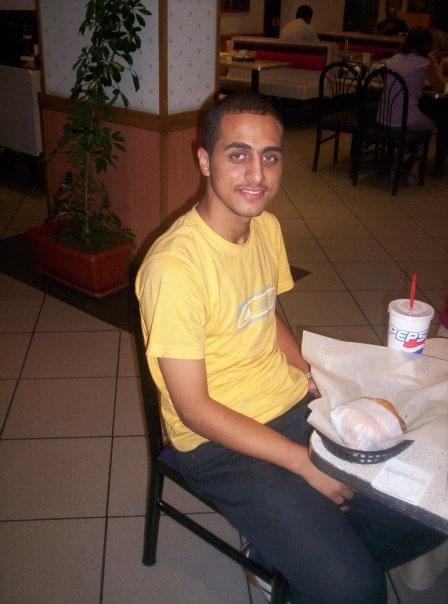

+++
title = "About"
assets = ["mosab-child.png"]
+++



The first ever personal computer that I owned, more than a couple decades ago!



I am a resourceful and passionate Software & Systems Engineer with two decades of experience, I have honed my skills in
designing, developing, operating, and maintaining software systems at various scales. My expertise spans multiple
industries and domains, and I am particularly passionate about Developing Large-scale Systems, Linux, Databases, Systems
Programming, Distributed Systems, and Automation at Scale, as well as Free Software and Open-source Software.

Throughout my career I have worked in the capacity of a Production Engineer at [Meta/Facebook](https://meta.com), where
I focused on improving the availability, scalability, performance, and reliability of our production services. Prior to
that, I worked at [Twitter](https://twitter.com), where I was dedicated to giving everyone the power to create and share
ideas and information instantly without barriers. I have also held positions at [GoCardless](https://gocardless.com),
[Levelset](https://levelset.com), [Wuzzuf](https://wuzzuf.net/), [Inmobly](http://www.inmobly.com/), 20@, and other
great companies.

Throughout my career, I have consistently sought out opportunities to push my own boundaries and continue learning and
growing as a Software & Systems Engineer. I am always looking for new challenges and ways to improve my skills, whether
it's through taking on complex projects or seeking out new training and education. My passion for the field drives me to
stay at the forefront of industry developments and to continuously seek out new ways to make an impact. As I move
forward in my career, I am excited to continue pushing myself to new heights, making meaningful contributions, and
developing innovative solutions to complex problems.

When not working, you can find me spending time with my lovely family or on my [hobbies](/hobbies) of
[reading](/hobbies/reading), [cycling](/hobbies/cycling), [DIY projects](/hobbies/diy), [cooking](/hobbies/cooking) and
[woodworking](/hobbies/woodworking).

Here are a couple pictures of the child me over the years!


  
Young me eating a sandwich and drinking a fizzy drink at the same time!




  
Baraa, my life best friend, and I in our first documented protest




  
Baraa and I in our favourite cafe (sorry for
  the fuzzy image, phones at the time didn't have good cameras!).




  
The first burger that I paid for with my first salary writing code.


