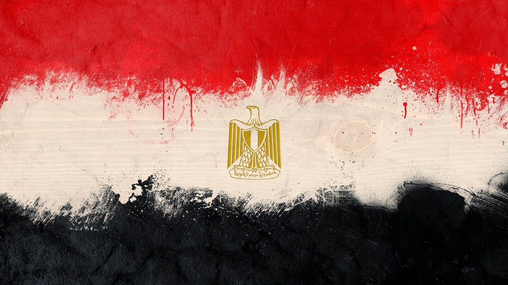

+++
title = "مصر المذكورة!"
date = "2013-12-01T00:00:00Z"
+++

**  
"مصر البلد الوحيدة المذكورة في القران"**  .. الجملة دي من أكثر الجمل المستفزة على الإطلاق بالنسبة لي ..

هي صحيح ذكرت، بس ذكرت ليه؟! هو أي ذكر بيبقى تكريم؟!!! ما هو قوم لوط وعاد ذكروا في القرآن برضه!!  
  
ذكرت علشان ربنا يحكي لنا قصة فرعون .. أكتر من مرة!  
  
ذكرت علشان السجن الوحيد اللي ذكر في القرآن هو سجن مصر!  
  
ذكرت علشان المسئولين في البلد دي خولات بطبعهم من زمان فشخ .. علشان عزيز مصر حبس نبي الله يوسف بعد ما لفق له تهمة علشان مراته كانت عاوزة تنام معاه في الحرام .. ولما عرف لفق له تهمة، وكمل عادي مع مراته ومش بعيد يكون ما حلقش شنبه كمان!  
  
"ثم بدا لهم من بعد ما رأوا الآيات ليسجننه حتى حين" .. ظهرت براءته ومع ذلك النظام قال خليه شوية  
  
"ادخلوا مصر إن شاء الله آمنين" .. سيدنا يوسف اللي قالها .. وقالها لأهله بس مش لكل الناس .. وما قالهاش غير لما ربنا سبحانه وتعالى كاد له وبقى مسئول كبير في البلد بعد كارثة طبيعية كبيرة فشخ هو اللي عرف يتعامل معاها ويخطط لها .. يعني مش مجرد مسئول وخلاص ..  
  
ذكرت علشان فرعون كل العصور بيستخف الشعب ده وبيطيعوه على طول ويفوضوه ويسيبوه يقتل فيهم ويقتلوا معاه كمان ويعذبوا ويسكتوا على الظلم وقشطة جدا معانا كشعب من زمان  
  
ذكرت علشان تحكي لنا عن الجشع البشري في أبشع تجلياته في قصة "قارون" .. اللي كان واحد عادي من الشعب بس أول ما ربنا إداه مال وعلم من نعيمه فشخ الناس..  
  
ذكرت علشان كل البشرية تتعظ مننا وما تعملش الخراء اللي احنا بنعمله ده .. بس احنا الوحيدين اللي عمرنا ما اتعظنا من تاريخ 7000 سنة، لا وبنقعد نتفشخر بيه واحنا ولا عارفين عنه حاجة أصلا!  
  
ذكر مصر في القرآن مش تكريم .. ذكر مصر في القرآن ده تجريس أبدي إلى يوم القيامة .. يا إما نتعظ ونتعلم يا إما هنفضل نكتة هذا الكوكب إلى أن يرث الله الأرض ومن عليها..  
  
مصر فخ وامتحان كبير فشخ مش وطن  
  
نُشِرَت أولا على شبكة التواصل الاجتماعي فيسبوك :  [https://www.facebook.com/mos3abof/posts/10152031441041047](https://www.facebook.com/mos3abof/posts/10152031441041047)
