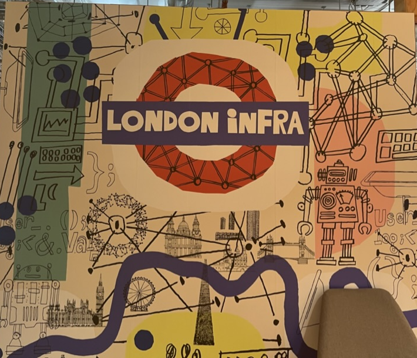

+++
title = "Joining Production Engineering at Facebook/Meta"
date = "2022-03-07T00:00:00Z"

[taxonomies]
tags=["career"]
+++

Super excited and thrilled to share that I am joining the Production Engineering team at
[Meta/Facebook](https://facebook.com) in London! Today is my first day.

Production Engineering was created at Facebook to work with engineering teams and partners to
champion the Reliability, Scalability, Performance, and Security posture of production services. PEs
are hybrid software and systems engineers; they are the glue holding things together, whether that’s
infrastructure and software or teams and processes.

The true power of Production Engineering comes from developing strong relationships with partner
engineering teams and valuing collaboration and knowledge sharing to build technical expertise and
community. PE’s write production code and solve hard problems in systems serving billions of people
across Facebook, services like Instagram, WhatsApp, and Oculus, and in diverse infrastructure areas
like machine learning/inference, storage, and networking.

If you still are trying to figure out what a production engineer does, watch [this
video](https://www.youtube.com/watch?v=TnCY6Apxibk)!

{{youtube(id="TnCY6Apxibk")}}

Or you can watch this presentation at SRECon 2015 that talks about Production Engineering at
Facebook and how it evolved:

{{youtube(id="ugkkza3vKbc")}}

Can not wait to get starts on a journey of challenges, learnings and hyper growth!
