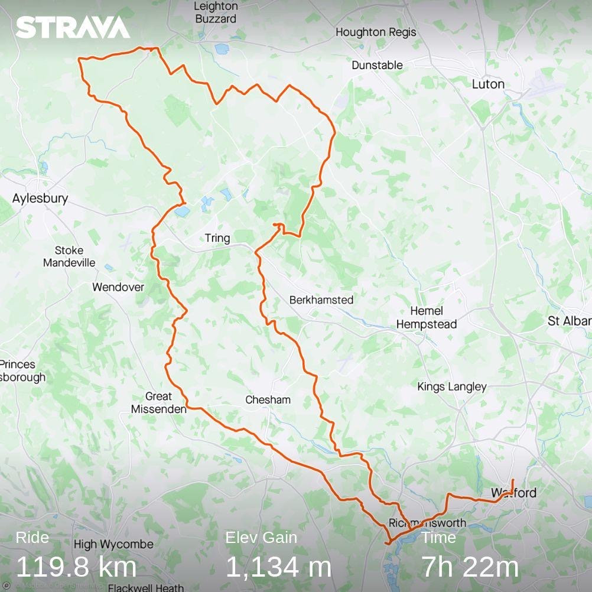
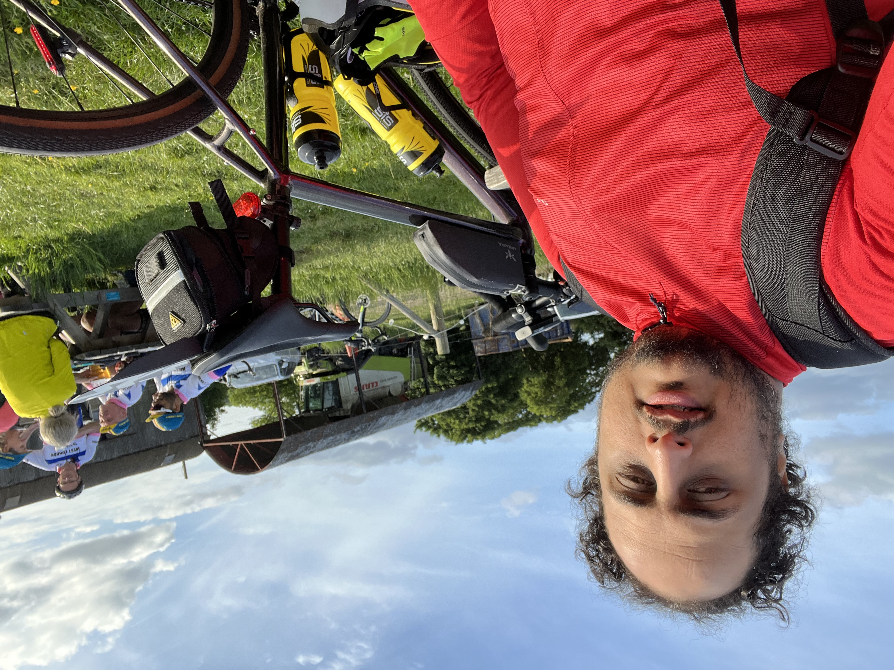

+++
title = "My First Metric Century"
date = "2022-05-21T23:00:00Z"
+++

Today I finished my first metric century (a ride that is 100km or more)! Was riding in “Tour De
Ricky” audax, and it was a challenging route for me. Took me 7 hours and 22 minutes of riding (10
hours if you include the cafe and rest stops) but I did it!

Distance: 119.8 km
Elevation Gain: 1134 m
Time: 7h 22m

Some lessons I learned from this ride are (in a very raw format, will iterate on them later):

1. I needed specific recommendations in regards to what to wear, and most resources talk guidelines,
which is something you don't want for the first few rides. In order to be able to take a guideline,
you need to have tried a few rides in different conditions first. I wanted specifics (like wear a
bibshort if it 10 degrees celsius or above, etc).

2. I definitely need more gears for those hills

3. It was great knowing my FTP, as I could only finish the ride by actively trying to keep my power
below the FTP especially on those hill.

   3.1. That required better shifting for the gears, and that's something I have always heard, but never
   really understood

   3.2. I also don't know if I was crossing the chains, will need to see

   3.3. This is one of the areas that people might benefit from videos on how to change the gears and in
   what order just like car drivers have

4. I DEFINITELY need to increase my FTP

5. I was lucky that I did not have any punctures, or mechanicals, but it was assuring that I got tools
with me

6. The back bag probably shouldn't have been there (over worrying about the weather made me pack extra
just in case)

7. I probably should've taken the power bank. Phones almost died at the end

8. I had a rear freehub that needs changing (there is play in the cassette) but there is nothing I
could do about it, as the part was delivered right before the ride. Was afraid it fails on me during
the ride, and paid extra attention not to put sudden impact on the drivetrain, luckily it didn't
fail!

9. Having the route on multiple devices was helpful

10. Cycling navigation experience could use a lot of improvement. This is not a solved problem yet.

11. Investing in a bike fit was one of the best things I did! Can't imagine doing this distance with the
original bike setup I got!

12. Servicing the bike, and changing the worn chain was also a contributing factor to minimise the risk
of getting a mechanical, I guess!

13. I should've planned the transportation to and from the start/finish point better! That cost me a
late start, and because of that I ended up doing the whole route alone instead of doing it with a
bunch of fellow colleagues, but that's ok.

Here is a video about the ride:


