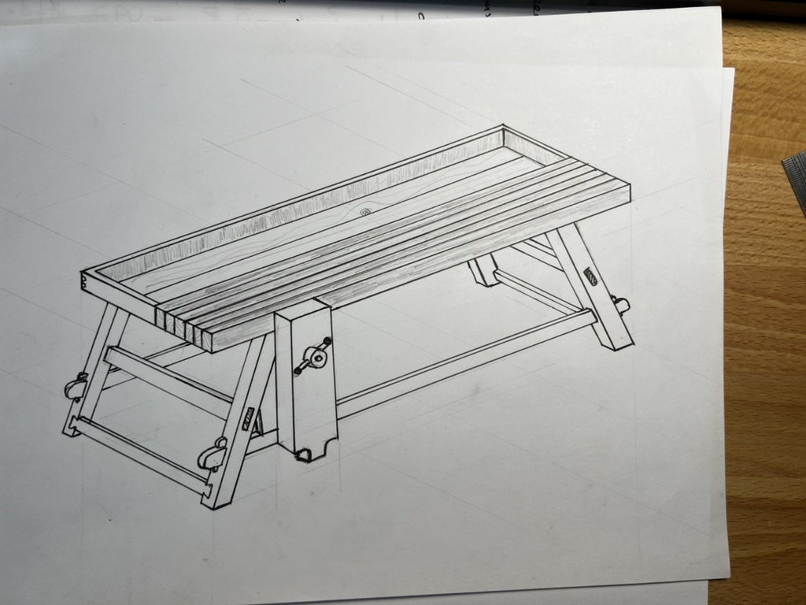

+++
title = "My First Ever Woodworking Project: The Moravian Workbench"
date = "2023-04-16T00:00:00Z"

[taxonomies]
tags=["woodworking"]
+++

For my first ever woodworking project I wanted to make a bench. A bench is an essential tool for a
woodworker, and it is also an amazing project to learn from. After a LOT of time spent researching
the type of bench I wanted to make, the Moravian Workbench was my favourite, so I went with it!

Started the project with a hand drawn sketch for the bench:

The design is a centuries old design called The Moravian Workbench that is portable. This can be
knocked down moved and reassembled.

Everything was made with hand tools, with very few exceptions. Here is how the project looks now:

There is a room for improvement, but I am pretty glad with the output. Not too bad for a first
timer.
