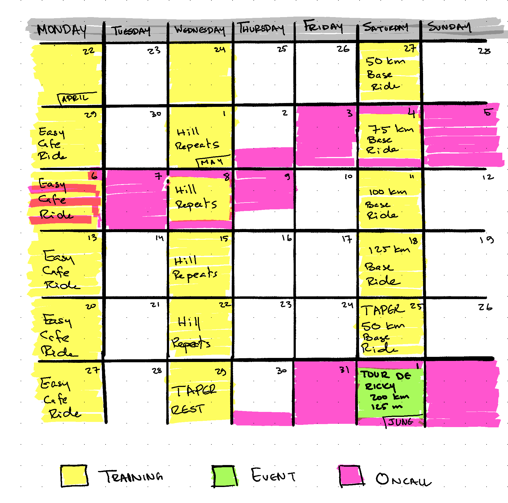

+++
title = "Joining the Tour De Ricky 200km Ride: A New Adventure Awaits!"
date = "2024-04-28T00:00:00Z"

[taxonomies]
tags=["cycling"]
+++

I am beyond excited to announce that I will be participating in the Tour De Ricky 200km (approximately 125 miles) ride event in 2024! As a beginner, yet passionate cyclist, I have always been drawn to challenging myself and pushing my limits (whenever I got time away from my job and other responsibilities), and this event promises to be an unforgettable experience.

## What is Tour De Ricky?

Tour De Ricky is an Audax event, part of Audax UK, a organization that promotes long-distance cycling events. 

What is an Audax ride, you ask me? No better answer than what Audax UK's website itself [has to say](https://www.audax.uk/about-audax/new-to-audax/), from which I quote:

> An Audax ride - known internationally as a Randonnée - is a cycle ride that has to be completed within a set time limit, including any stops to eat or rest. In most cases, riders have to maintain a minimum speed of 15km/h (some particularly long or hilly rides have a slightly lower minimum speed) and importantly a maximum speed of 30km/h. That's a little under 10mph and 20mph in Imperial measures.
> 
> It's not a race and individual riders' times are not published; if you finish within the time limit, you've succeeded.
> 
> Riders are expected to be self-sufficient. That doesn't mean that you have to ride alone or that you can't call on the services of a village blacksmith to help weld your frame back together, should the worst happen, but you navigate for yourself and if you do have any mechanical problems along the way, it's down to you to sort them or get yourself home. 
> 
> Some rides offer food along the way; more often, you'll be finding your own sources of fuel, from cafes and pubs to village shops and service stations. 
> 
> Throw in the hills, the British weather and distances ranging from 50km to 1400km and what might have sounded like a simple bike ride becomes more of a challenge - one that is appealing to increasing numbers of cyclists year on year.

You can also watch this great video explaining what Audax is:

{{ youtube(id="qreIQjtClbw" class="w-fit") }}

The Tour De Ricky event in particular offers a range of routes, 50km, 100km, and 200km long in distance, but I have set my sights on the 200km challenge. This particular route promises a full day of excitement, with a mix of rolling hills, scenic countryside, and quiet roads.

## The 200km Route: A Challenge Awaits

The 200km route is designed to test the rider's endurance and cycling skills. With a total elevation gain of 2,500 meters, I will need to be prepared for this ride, since it has been a long time with me out of the saddle, and in a relatively short period of time too (4-5 weeks). The route will take the riders through some of the most beautiful landscapes in the country, with picturesque villages, ancient woodlands, and stunning views of the surrounding countryside.

## Why I'm Excited

I'm excited to join the Tour De Ricky 200km bike ride for several reasons. 

Firstly, I love the sense of community that comes with participating in a mass cycling event that is not competitive in nature (i.e. it is not a race). I'm looking forward to meeting fellow cyclists, sharing stories, and making new friends. 

Secondly, I'm eager to challenge myself and push my limits. Completing this event will be a huge achievement, and I'm excited to see how far I can push myself. Finally, I'm looking forward to the scenic route and the opportunity to explore new parts of the country.

Thirdly, I have participated in the 100km ride in 2022, and it is still my longest ride so far (~120km). I did not get back to the start within the event's time limit, and I even lost my Brevit! So it was not counted as a success in Audax UK records (although it is a huge success in my personal records), so I am determined to get to the finish line within the time limit this year.

## Training and Preparation

While I'm excited, I'm also aware that this event requires careful preparation and training. Over the coming weeks and months, I will be putting in the miles, honing my cycling skills, and building up my endurance. I will be working on my bike, making sure it's in top condition, and preparing myself mentally and physically for the challenge ahead.

Above is a hand drawn/written training calendar that fits my current work schedule (with return to office et al), and hopefully I can manage to finish it. It is not enough, but it will have to do.

I also discovered that the ride day will be in one of my oncall shifts, so I will have to find a swap for that! :D

## Conclusion

The Tour De Ricky 200km ride, if successful, will be my first Century Ride, a ride that is a 100 miles long, or more, and will be a dream come true for me. I have done a [Metric Centry](https://mosab.co.uk/blog/first-metric-century/) before, also with Tour De Ricky. I'm excited to be part of this amazing event once again, to challenge myself, and to experience the thrill of long-distance cycling. If you're a fellow cyclist, I encourage you to join me on this adventure. Let's ride together and make some unforgettable memories!

## Useful Links:
- [Tour De Ricky Website](https://tourdericky.uk/)
- [Tour De Ricky 200km Route](https://tourdericky.uk/200km-a-full-day-of-challenge/)
- [Audax UK Website](https://www.audax.uk/)