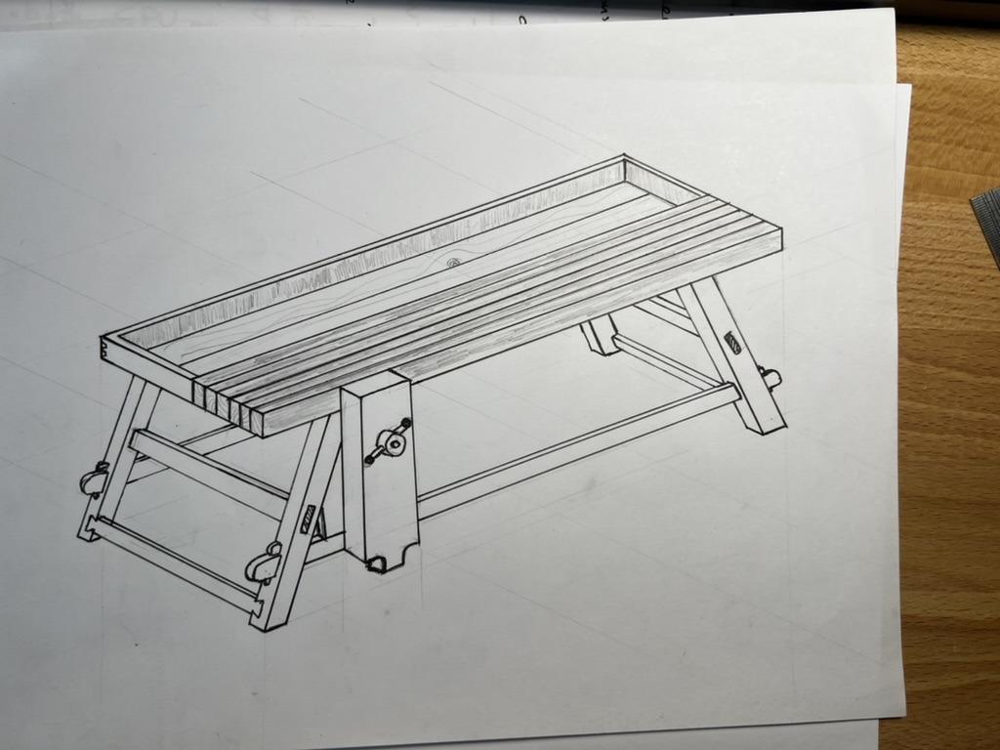

+++
title = "Moravian Workbench"
[taxonomies]
tags=["woodworking"]
categories=["hobbies"]
+++

I picked up woodworking and it is such therapeutic hobby! For my first woodworking project ever, I
picked the very challenging "Moravian Workbench". Here is a sketch I drew for the project:

The design is a centuries old design called The Moravian Workbench that is portable. This can be
knocked down moved and reassembled.

Everything was made with hand tools, with very few exceptions. Here is how the project looks now:

Will post more details of the journey here.
