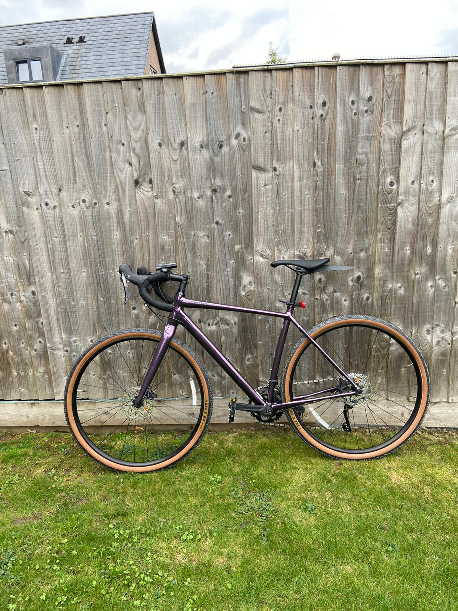
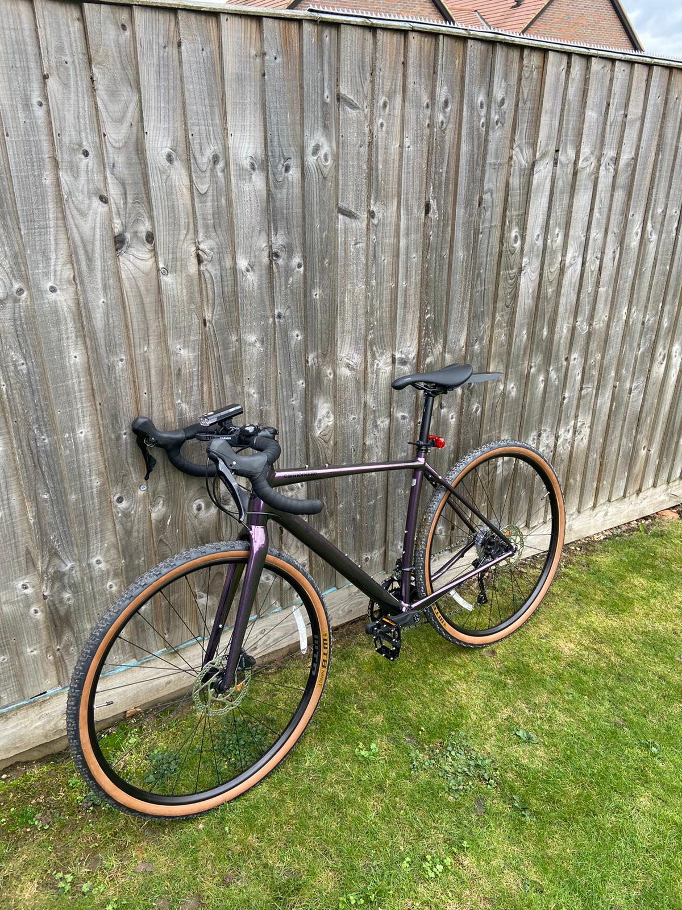
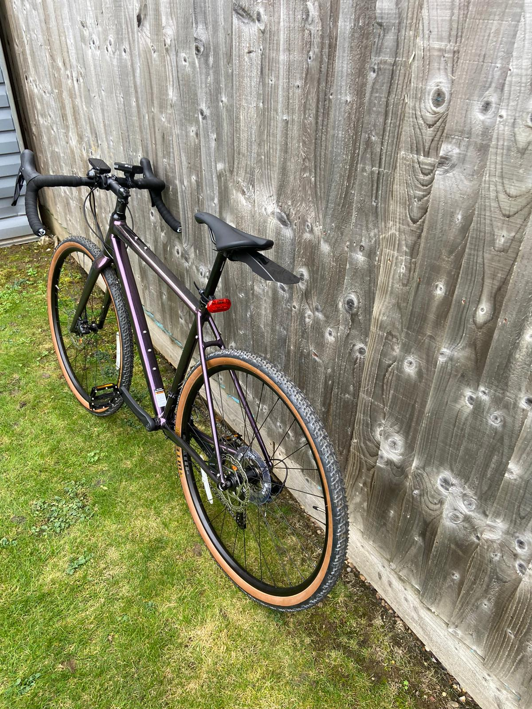
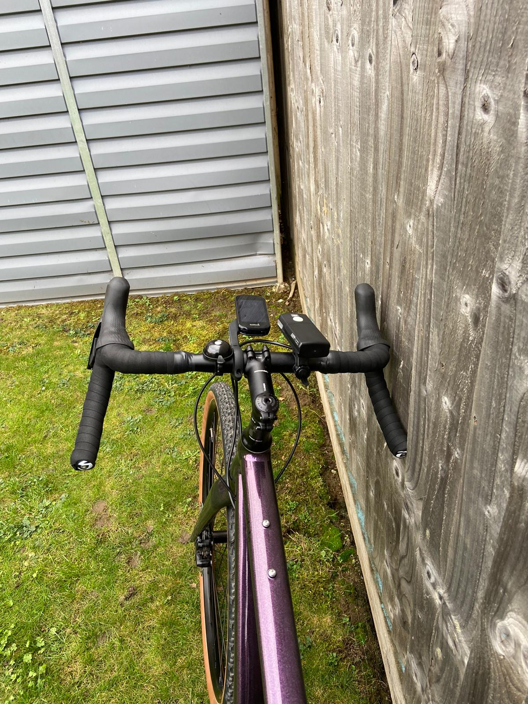

+++
title = "ركوب الدراجات الهوائية"
+++

مؤخرا دخلت العالم السحري لرياضة ركوب الدراجات الهوائية. هذه بعض صور دراجتي من نوع Cannondale Topstoe 2.

يمكنكم مطالعة ملخص [الرحلة المئوية الأولى](/blog/first-metric-century/) التي قمت بها (١١٩ كم).

يمكنكم أيضا التواصل على منصات التواصل الخاصة بالرياضة مثل [Garmin](https://connect.garmin.com/modern/profile/18583322-eb7e-4f3f-8179-705ed2de5438)،[Komoot](https://www.komoot.com/user/1565437931381)، أو [Strava](https://www.strava.com/athletes/60680051).

## أنشطتي على منصة Strava

<iframe
  height='160'
  width='300'
  frameborder='0'
  allowtransparency='true'
  scrolling='no'
  src='https://www.strava.com/athletes/60680051/activity-summary/9b24178edb4091c708c0ab0685680dbedc141f7b'></iframe>

## بعض الطرق الظريفة

<iframe
  src="https://www.komoot.com/tour/636080427/embed?profile=1"
  width="100%"
  height="680"
  frameborder="0"
  scrolling="no"></iframe>

## بعض مقاطع الفيديو

{{youtube(id="kbq9XcBJdQk")}}

{{youtube(id="O0s0MB4IKCw")}}

{{youtube(id="U4LP-4IYHtg")}}
